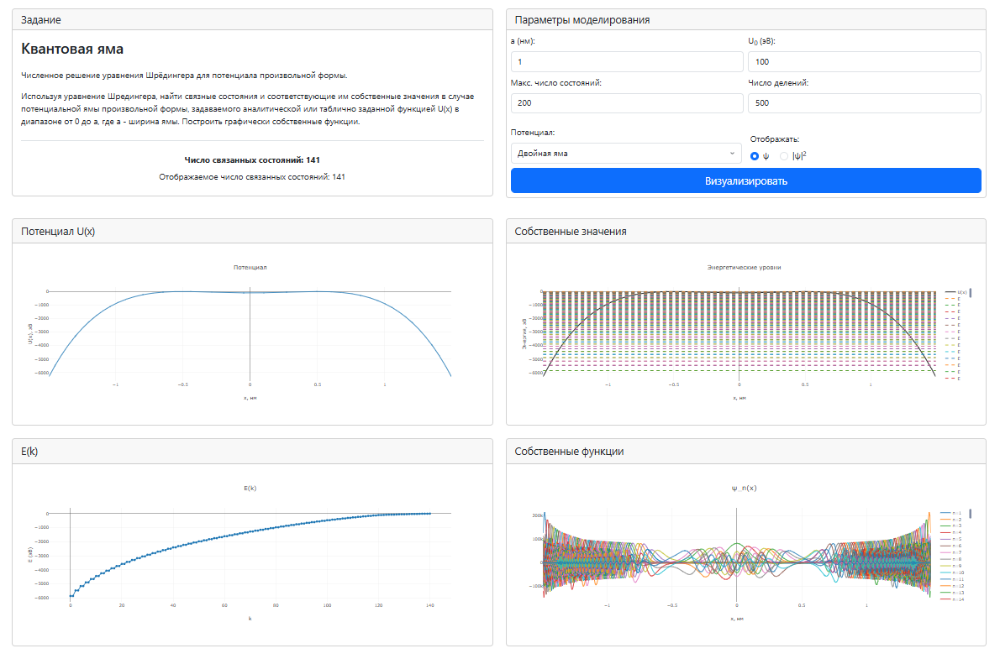

## Описание
Веб-приложение для численного решения стационарного уравнения Шрёдингера и визуализации связанных состояний частицы в потенциальной яме произвольной формы.

Приложение:
- позволяет задавать параметры потенциальной ямы (ширина, глубина, форма);
- численно находит собственные значения и собственные функции;
- строит графики волновых функций и спектра частицы в яме, а также отображает потенциальную яму и зависимость энергии от номера уровня.

Реализовано на Python/Flask с визуализацией через Plotly.

## Интерфейс 

